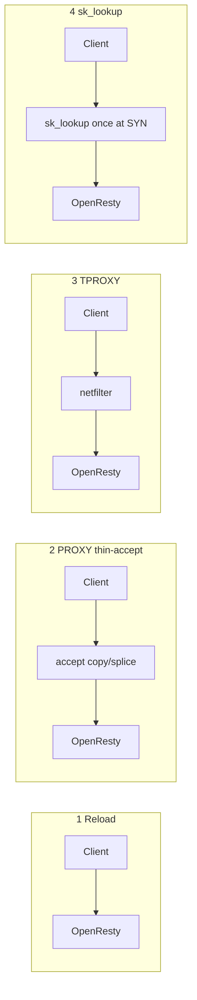

# 动态非标端口方案：性能向深入对比

前提（已定）：Client→WAF；TLS 在 OpenResty 终结；要支持任意非标端口；**性能非常重要**。

对比对象：

1. **Reload**：OpenResty 改 listen + 优雅 reload  
2. **PROXY + thin-accept**：用户态薄入口 TCP 透传 + PROXY v2 + UDS/本机  
3. **TPROXY**：内核透明重定向到引擎（可带极薄用户态）  
4. **BPF sk_lookup**：内核把多端口派到 OpenResty 已有 listen socket（Cloudflare Tubular 同类）

---

## 1. 数据路径（稳态已建连）

已建立 TCP 后，sk_lookup **不再介入**（只影响 listen 查找）；性能差主要来自「多一跳用户态」和「多一次拷贝/系统调用」。

| 方案 | 稳态用户态转发跳数 | 典型额外开销 |
|------|-------------------|--------------|
| Reload | 0（直达引擎） | 无额外转发；代价在变更与 listen 规模 |
| PROXY+accept | +1 | 每字节多一次用户态读写或 splice；多一倍本机 fd/上下文 |
| TPROXY | 0～0.5 | 内核重定向；调得好可接近直达 |
| sk_lookup | 0 | 建连时 map 查找；稳态≈直连 OpenResty |

**性能排序（稳态吞吐/延迟，理想实现）**  
`Reload ≈ sk_lookup ≥ 调优 TPROXY >> PROXY+thin-accept（即使用 splice）`

WAF 场景 CPU 大头往往在 **TLS + Lua 检测**，本机多一跳可能只占整体的一小部分；但若你已经把引擎榨干，或要上很高 PPS/短连接，这一跳会很明显。

---

## 2. 建连路径（短连接敏感）

| 方案 | 建连额外成本 | 备注 |
|------|-------------|------|
| Reload | 基线 | 标准 bind 查找；**端口极多时**内核 LHTABLE 链表变长，Cloudflare 指出大量 listen socket 会拖慢 lookup |
| PROXY+accept | 高 | 两次 accept/connect 语义：外层 accept + 连引擎 + 写 PROXY 头 + 再 TLS |
| TPROXY | 低～中 | netfilter 规则/conntrack 成本 |
| sk_lookup | 低 | SYN 时跑 BPF，通常 O(1) map；**避免「每端口一个 socket」的查找劣化** |

短连接 + 大量非标端口：sk_lookup 的优势不只是「少一跳」，还包括 **listen 规模不随端口数线性爆炸**。

---

## 3. 「任意端口」规模维

假设开通端口从几十 → 成百上千（接近任意）：

| 方案 | 端口变多时 | 风险 |
|------|-----------|------|
| Reload | conf 膨胀、reload 更重、listen fd 暴涨 | 变更抖动、内存、lookup 变慢 |
| PROXY+accept | 每端口一个 listen fd 在 accept 进程 | fd/epoll 规模；仍比全放 OpenResty 好隔离 |
| TPROXY | 规则/端口集合维护 | nft 规则复杂、排障难 |
| sk_lookup | **map 一项/端口**，OpenResty 仍少数 socket | 内核版本与 BPF 运维；最贴「任意端口」 |

Cloudflare 开源 **Tubular** 的动机之一：BSD bind 模型在「大量地址/端口」下不够用，用 sk_lookup 在边缘规模化。

---

## 4. TLS 与端到端一致性（性能相关）

四条都可以做到 **TLS 只在 OpenResty 终结一次**（PROXY/TPROXY/sk_lookup 均透传 TCP）。

禁止的反模式（性能与语义双杀）：

- 入口 TLS 终结 + 再加密到引擎  
- 入口完整 HTTP reverse proxy 再 upstream 到 OpenResty  

---

## 5. 拷贝与系统调用（PROXY 方案如何少亏）

若短期上 PROXY+accept，要逼近上限必须：

1. UDS，不走 `127.0.0.1`  
2. `splice` / 高效双向拷贝；评估 io_uring（视实现）  
3. SO_REUSEPORT、CPU 亲和，accept worker 与 OpenResty worker 对齐  
4. PROXY v2 头只在建连写一次，不影响稳态载荷路径  
5. 永不在 accept 层做 HTTP 解析  

即使用尽手段，也**抹不掉**「多一个用户态转发实体」的结构性成本；只能缩小它。

---

## 6. 变更路径性能（加删 65500）

| 方案 | 加端口时 | 对存量连接 |
|------|---------|-----------|
| Reload | 写 conf + reload | 优雅 reload 有 worker 交替；高流量下可抖 |
| PROXY+accept | bind 新端口 | 一般不影响已有连接 |
| TPROXY | 更新规则 | 需小心 conntrack/顺序 |
| sk_lookup | **更新 map** | 通常最轻；Tubular 强调可在线改地址/端口 |

变更频繁时：`sk_lookup ≥ PROXY+accept > TPROXY ≈ Reload`。

---

## 7. 风险对性能的「暗税」

- **Reload**：看似稳态最快，但运维被迫 reload → 实际平均性能与稳定性变差  
- **PROXY**：实现烂（双 TLS、用户态抄包）可轻易亏 20%+ CPU  
- **TPROXY**：conntrack/规则错误会导致绕路或落软路径  
- **sk_lookup**：内核过旧不可用；与其它 BPF/CNI 冲突时可能被迫关掉加速路径  

---

## 8. 结论（性能优先）

### 长期目标态（推荐）

**BPF sk_lookup → OpenResty（TLS+WAF）**

- 稳态接近直连引擎  
- 任意端口 = map，不在用户态堆 listen  
- 与 Cloudflare Spectrum/Tubular 同一技术路线  
- 前提：内核 ≥ 5.10 级、能接受 BPF 运维、POC 验证「对外端口可见性」

### 过渡 / 快速验证

**PROXY + 极致优化的 thin-accept**

- 产品语义、TLS 一致性好做  
- 性能可接受（尤其 TLS+Lua 占大头时）  
- 作为对照基线：量出「多一跳」真实占比，再决定是否上 sk_lookup

### 不优先

- **Reload 撑任意端口**：稳态好看，规模与变更性能差  
- **TPROXY**：性能可为第二梯队，但复杂度高、收益通常不如直接 sk_lookup  

### 决策序

1. 定内核基线是否允许 sk_lookup  
2. 若允许：M1 用 PROXY 验证业务语义；**并行** sk_lookup demo 打性能与 `$waf_external_port`  
3. 性能门禁：对比「直连 OpenResty」——P99、CPU/RPS、短连接 CPS  
4. 门禁过了用 sk_lookup 作为数据面终局；PROXY 仅作兼容/回退  

---

## 9. 建议压测矩阵

对同一硬件、同一 Lua 规则：

| 场景 | 指标 |
|------|------|
| 长连接吞吐 | Gbps、CPU、P99 |
| 短连接 | CPS、握手 P99 |
| 端口规模 | 开通 10 / 100 / 1000 端口时建连 P99 |
| 变更 | 加删端口时 P99 尖刺 |
| 对照 | 直连 OpenResty 单端口基线 |

通过标准示例：sk_lookup 相对基线额外 CPU < 3%～5%（视机型）；PROXY 额外 CPU 可到更高，需实测标定。
