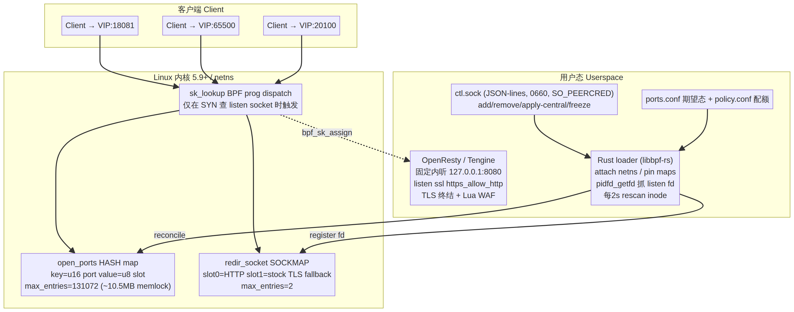
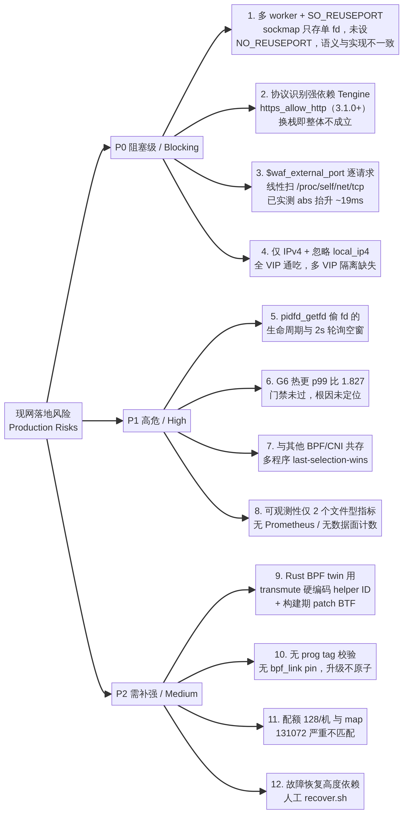
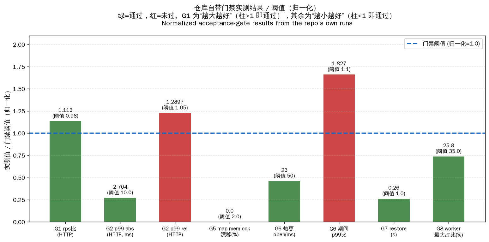
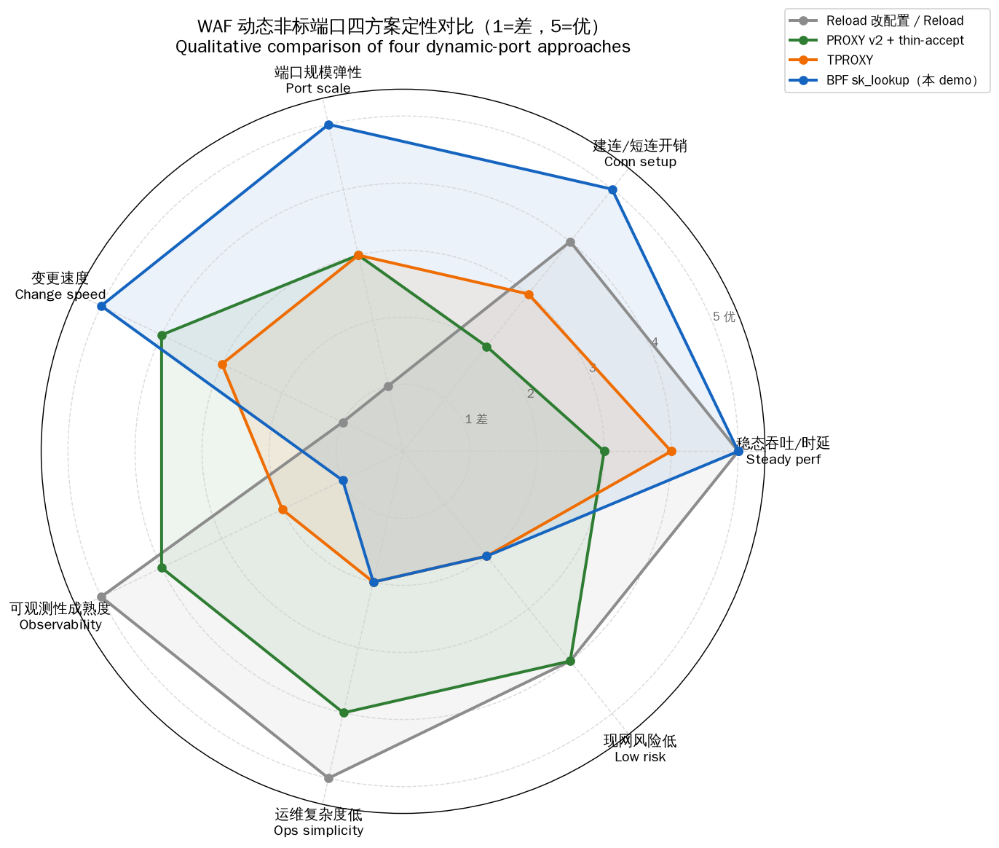
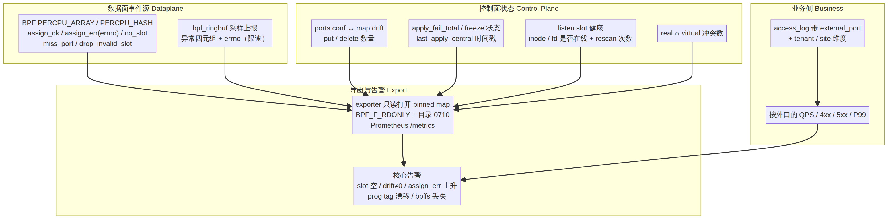
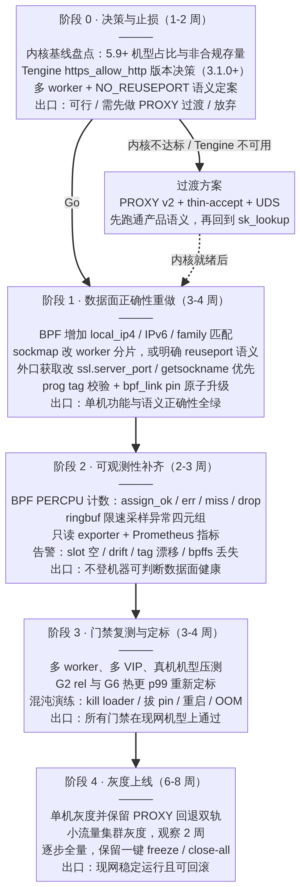

# WAF 动态非标端口 sk_lookup 方案技术评审报告

**评审对象**：[woodyhymns/waf-sklookup-demo](https://github.com/woodyhymns/waf-sklookup-demo)（`main@f353271`，含 C 与 Rust 两套 BPF 实现及 Rust 用户态 loader）
**评审目标**：现网完整落地可行性、性能无损、可观测性经得住现网考验
**作者**：Manus AI
**日期**：2026 年 8 月 16 日

---

## 一、总体结论

先给结论，方便你直接向上汇报：

> **技术路线选对了，工程完成度也远超一般 demo，但当前代码距离"现网完整落地"仍有实质性缺口。缺口不在 BPF 本身，而在三个地方：多 worker 语义、外部端口的获取方式、以及可观测性几乎为零。这三项都属于必须重做而非补丁级修改。**

`sk_lookup` 是 Linux 内核为"一个 L7 代理需要监听大范围端口"这一场景专门引入的机制，其官方文档明确把"接收全部或大范围端口上的连接，即 L7 代理场景"列为设计动机之一，并指出传统做法需要为每个地址端口对创建并 `bind()` 一个 socket，会带来资源消耗和 socket 查找的延迟尖刺 [1]。你的场景与此高度吻合。Cloudflare 也正是用同一机制支撑 Spectrum 产品在全部 2^16 端口上提供服务，并把控制面工具 Tubular 开源 [2]。因此**方向层面不需要犹豫**。

但仓库当前实现有一个必须点明的结构性事实：**它是在 `worker_processes 1` 的单 worker 环境下验证的，`redir_socket` sockmap 只有两个槽位，且 README 明确把"multi-worker reuseport sockmap"列为不在范围内**。现网 WAF 不可能单 worker 运行，所以这不是"待优化项"，而是数据面模型本身还没有为现网设计完。

关于你倾向 Rust 这一点：**Rust 用于用户态 loader 是明确正确的选择，仓库已经把它做成默认，质量也不错；但用 Rust 写 BPF 内核侧程序在当前这个实现里是净风险。** 详见第五章第 9 项。

| 你的三个目标 | 当前状态 | 结论 |
|---|---|---|
| 1. 能在现网完整落地 | 单机、单 worker、单 VIP、IPv4-only 场景已验证；多 worker/多 VIP/IPv6 未覆盖 | **未达成**，需重做数据面匹配与 sockmap 模型 |
| 2. 性能不能有损耗 | 稳态与直连基本持平（G1 rps 比 1.113/1.003，G2 p99 abs 差 2.7ms/0.025ms），但 G6 热更期间 p99 比 1.827 未过门禁 | **方向达成，定标未完成**，且现有数据不具现网代表性 |
| 3. 可观测性经得住现网考验 | 仅两个文件型指标（`apply_fail_total`、`last_apply_central`），数据面零计数、零 exporter | **未达成**，这是当前最大短板 |

---

## 二、方案架构还原

我把仓库代码还原成下面这张图，便于对齐认知。核心是：**外部端口不在用户态 `bind`，而是作为 BPF hash map 中的一条记录存在；内核在 TCP 建连查找 listen socket 时，把这些"虚拟端口"的 SYN 通过 `bpf_sk_assign` 指派给 OpenResty 已经存在的固定内部 listen socket。**



数据面代码本身极简，`dispatch.bpf.c` 只有 69 行，逻辑是：非 TCP 直接 `SK_PASS`；取 `ctx->local_port` 查 `open_ports`；查不到 `SK_PASS`（交回常规 bind 查找）；查到则按 slot 取 `redir_socket` 中的 socket 并 `bpf_sk_assign`。这种"薄内核程序 + 厚用户态"的比例分配与 Cloudflare 的经验一致，他们明确指出 eBPF 代码与用户态代码的比例往往差一个数量级以上 [2]。

用户态 loader 的关键设计有四点值得肯定：

**第一，无常驻状态依赖。** 状态存在内核 map 并 pin 到 `/sys/fs/bpf/waf-sklookup`，`ctl` 类命令是短命进程直接打开 pinned map。这与 Tubular 的核心设计决策相同——Tubular 明确放弃了常驻 daemon，因为"daemon 可能崩溃"，改为用短命 `tubectl` 调用配合内核持久化状态来获得崩溃韧性 [2]。

**第二，用 `pidfd_getfd` 获取 OpenResty 的 listen fd。** `listen_fd.rs` 解析 `/proc/net/tcp` 找到 LISTEN 状态的 inode，遍历 `/proc/*/fd` 定位持有者，再用 `pidfd_open` + `pidfd_getfd` 复制 fd。这也正是 Tubular 采用的第三种方案，因为"很多流行软件不用 systemd socket activation"，而 `SCM_RIGHTS` 需要改造业务进程 [2]。选型正确。

**第三，期望态驱动 + fail-closed。** `ports.conf` 是本机期望态，`policy.conf` 提供 deny 列表、特权端口白名单和配额；任何一条端口绑定不合法（缺 tenant/site、命中 deny、特权端口未放行、超配额）会**整单拒绝**而不是部分生效（`desired.rs` 与 `policy.rs`）。`central/desired-state.json` 作为中心期望态，`apply-central` 校验通过后才落本机缓存。这个语义设计是对的。

**第四，真实 listen 与虚拟端口的冲突门禁。** `nginx_listen.rs` 会解析 nginx 配置中的 `listen` 行，并把 80/443/8080/8443 硬编码为"真实监听"；`ctl.rs` 的 `fail_on_overlap` 在 add/reconcile/apply-central 前做 real∩virtual 交集检查，有冲突就拒绝。这个防护点考虑得很好，很多人做这类方案会漏掉。

---

## 三、你可能欠考虑的地方：概览

这是本次评审的核心产出。我按"是否阻塞现网上线"分成三级，共 12 项。



---

## 四、P0 阻塞级问题（不解决不能上线）

### 4.1 多 worker + SO_REUSEPORT：语义与实现不一致，且模型未设计完

这是我认为**最严重**的一项。

`redir_socket` 是一个 `max_entries=2` 的 SOCKMAP，slot 0 存 HTTP listen fd，slot 1 存 stock OpenResty 的 TLS fallback listen fd。`docs/recovery.md` 里写得很直白：

> `redir_socket` has two protocol slots, not worker shards: slot 0 is HTTP and slot 1 is the stock-demo TLS fallback. […] There is no listen sharding.

也就是说，在多 worker + `SO_REUSEPORT` 的现网配置下，**loader 只把 reuseport 组里的某一个 worker 的 listen fd 放进了 sockmap**，`rescan_slot` 也只是在 `/proc/net/tcp` 里挑"第一个还能通过 `/proc/*/fd` 打开的 inode"。

有意思的是，P1-b 实测显示 4 个 worker 的分布是 25.8% / idle=0，看起来很均衡。**但这个"通过"是靠内核的隐式行为拿到的，而不是代码设计出来的。** 原因在于 `bpf_sk_assign` 的 `flags` 参数：内核提供 `BPF_SK_LOOKUP_F_NO_REUSEPORT` 标志用于"跳过所选 socket 所在 reuseport 组内的负载均衡" [3]，而 `dispatch.bpf.c` 与 Rust twin 都传 `flags=0`，因此**内核在拿到你指定的那个 socket 之后，仍会在它所属的 reuseport 组内再做一次选择**。内核文档也提到过 "Run reuseport logic on sockets selected by BPF sk_lookup" 这一设计演进 [4]。

这带来三个现实问题：

第一，**运维心智模型与实际行为脱节**。代码注释和恢复手册都说"slot 里的那个 fd 决定 SYN 去哪个 worker"，实际不是。当 worker 分布出现倾斜、或某 worker 卡死时，排障人员会按错误的模型去查。

第二，**`rescan` 的语义变得模糊**。既然实际由 reuseport 组决定，那么"slot 里放的是哪个 worker 的 fd"在正常情况下不影响分发；但一旦该 fd 对应的 worker 死掉且 fd 已失效，`bpf_sk_assign` 会返回 `-ESOCKTNOSUPPORT`（socket 不在允许状态）[3] 从而 `SK_DROP`，而此时其余 worker 明明健康。这意味着**单个 worker 的异常可以打掉全部虚拟端口的新建连**，而真实 `bind` 的端口不受影响——故障域被人为放大了。2 秒轮询窗口内这个洞是敞开的。

第三，**这个雷区在 nginx 生态有实证**。nginx 社区已披露 `quic_bpf` + `reuseport` 会因 nginx 不关闭 stale reuseport socket 而最终丢弃 HTTP/3 流量 [5]，性质完全相同——BPF socket 选择与 nginx worker 生命周期管理之间存在真实的不匹配。

**建议**：必须二选一并明确写进设计文档。方案 A 是把 `redir_socket` 改成 worker 分片（`max_entries` = worker 数上限，key 用 `bpf_get_smp_processor_id()` 或哈希四元组），并显式传 `BPF_SK_LOOKUP_F_NO_REUSEPORT`，完全自己掌控分发；方案 B 是承认并依赖 reuseport 组行为，那就必须保证 sockmap 里的 fd 永远是组内活着的成员，并把 rescan 从 2 秒轮询改成事件驱动（如 netlink socket 事件或 `inotify` + nginx master 通知）。我倾向方案 A，因为它让故障域和行为都变得可解释。

### 4.2 协议识别强依赖 Tengine `https_allow_http`，这是整个方案的单点

`sk_lookup` 工作在建连阶段，此时还没有任何应用层字节，**内核无法知道这条连接是 HTTP 还是 TLS**。代码注释对此非常诚实：

> Protocol (plaintext HTTP vs TLS) is NOT decided here — production OpenResty/Tengine does that on the listen via `https_allow_http`.

于是产品形态要求那个唯一的内部 listen 必须同时接收明文和 TLS，也就是 `listen 127.0.0.1:8080 ssl https_allow_http;`。这个 `https_allow_http` 是 Tengine 3.1.0（2023 年 10 月）新增的 `listen` 选项，用于"在 TLS listener 上接收 HTTP 流量" [6] [7]，**stock nginx 和 stock OpenResty 都没有**。仓库自己也用 `nginx -t → invalid parameter` 确认了这点，并把 `:8080` HTTP + `:8443 ssl` 的双 listen 明确标注为"不是产品模型"的 fallback。

这意味着：

- 你的现网引擎**必须**是 Tengine 3.1.0+，或自行维护 `https_allow_http` 补丁（仓库 `third_party/https_allow_http/` 里正是这么做的，打在 nginx-1.19.3 上）。
- 如果现网跑的是 stock OpenResty，那么方案退化为"HTTP 端口集合和 HTTPS 端口集合必须在控制面预先分开"。这直接和你的需求冲突——客户接入时未必能预知，而且一个域名从 HTTP 改成 HTTPS 就需要改 slot，而 slot 变更是 map 写入，虽然快，但语义上你已经把"协议"变成了控制面必须掌握的状态。
- 维护自打补丁的 Tengine/nginx 会带来长期成本。Tengine 近期也出过 worker 崩溃类 CVE [8]，自维护分支的安全跟进负担需要提前算进去。

**建议**：在阶段 0 就把引擎版本决策做掉，这是整个方案的前置条件。如果 Tengine 3.1.0+ 不可得，一个可行的折中是在 `sk_lookup` 之后不做协议判断，而在 OpenResty 侧用 `ssl_preread`/stream 模块或自研的 client-hello 探测做一次协议分流——但这会引入额外一跳，需要单独评估。**在引擎决策明确之前，不要投入阶段 1 的开发。**

### 4.3 `$waf_external_port` 的获取方式：逐请求线性扫 `/proc`，这是设计缺陷不是性能问题

`sk_lookup` 之后，nginx 的 `$server_port` 变成了内部 listen 端口（8080），不再是客户端真正访问的端口。仓库为此写了 `openresty/lua/waf/external_port.lua`，在 `access_by_lua` 阶段解析出真实外部端口。但它的**首选路径**是：

```lua
local f, err = io.open("/proc/self/net/tcp", "r")
...
for line in f:lines() do  -- 逐行线性扫描，匹配 remote_addr:remote_port
```

**每一个请求**都要打开 `/proc/self/net/tcp` 并线性扫描全表，找到 remote 四元组匹配的 ESTABLISHED 行，才能读出 local port。这有四个层次的问题：

第一，**这是阻塞式文件 I/O，且在 nginx 事件循环里同步执行**。`io.open` 是 LuaJIT 标准库调用，不走 cosocket，会阻塞整个 worker。

第二，**复杂度是 O(连接数)**。现网单机几万条连接时，每个请求扫几万行——总复杂度是 O(QPS × 连接数)。仓库自己的实测已经量化了这个代价：把 `resolve()` 替换成常量桩之后，**p99 绝对值从约 19ms 降到约 0.5ms**（`docs/repro-g2-http-p99.md` probe 3）。这不是 3%~5% 的税，这是一个数量级的差异。而这还是在只有 3 个端口、单 worker、几百 rps 的 demo 环境里测出来的。

第三，**它在高并发下会返回错误结果**。匹配条件只有 `remote_ip:remote_port` + 状态 `01`（ESTABLISHED）。在 NAT 后大量客户端复用源端口、或存在 TIME_WAIT 残留时，同一个 `remote_ip:remote_port` 可能对应多行，代码取第一个匹配。这会**串错端口**——而这个端口正被用于 ACL 判决和限流（P1-c 验证的正是这条路径）。也就是说，一个概率性的解析错误会变成安全策略的误判。

第四，**fallback 路径也不理想**。`port_from_req_socket()` 走 `ngx.req.socket(true):getfd()` + FFI `getsockname()`。这个方向是对的，但仓库有一次 PR（#10）把 getsockname 提前，之后又被 revert（`d5a0128` "Revert: prefer getsockname in waf.external_port resolve"），说明这条路当时有未解决的问题，需要重新查清原因。

**建议**：彻底放弃 `/proc` 扫描路径。优先级应该是：

1. **`ngx.ssl.server_port()`**：`lua-resty-core` 提供该 API，可在任何"下游使用 https"的上下文返回 server port，同族的 `ssl.raw_server_addr()` 返回"当前 SSL 连接中客户端实际访问的服务端地址" [9]。这是原生 C 层实现，零 `/proc` 开销。需要实测确认 `sk_lookup` 指派后 nginx 内部记录的 local sockaddr 是否已是外部端口。
2. **`getsockname()` on connection fd**：把 revert 掉的 PR #10 方向查清原因后重做。`getsockname` 是单次系统调用，O(1)。
3. **在 BPF 侧记录，用户态直读**：最彻底的方案是在 `sk_lookup` 里把 `(remote_ip, remote_port) → local_port` 写入一个 LRU hash map，OpenResty 侧用 FFI 读 pinned map。这样连系统调用都省了，且完全避免歧义。代价是需要处理 map 老化。

无论选哪条，**都必须在阶段 1 完成，因为它同时影响性能和正确性**。

### 4.4 只匹配端口，不匹配目的 IP，且只支持 IPv4

`dispatch.bpf.c` 的判断只有两条：`ctx->protocol != IPPROTO_TCP` 和 `ctx->local_port` 是否在 map 里。**`ctx->local_ip4`、`ctx->local_ip6`、`ctx->family` 全部未使用。**

后果是：一旦某个端口进了 `open_ports`，**这台机器上所有 IP 地址（包括所有 VIP、所有物理网卡地址、`127.0.0.1`）的该端口都会被劫持到那一个 OpenResty listen**。这与 Tubular 的做法形成鲜明对比——Tubular 用 LPM trie 存 `(protocol, port, prefix)` 到 destination 的映射，正是为了支持"多个服务在不同地址上使用同一端口共存"，Cloudflare 明确把它列为需求之一 [2]。

对现网 WAF 的具体影响：

- **多 VIP 隔离缺失**。如果一台 WAF 承载多个客户 VIP，客户 A 在 VIP-1 上开了 30000 端口，那么 VIP-2、VIP-3 上的 30000 也同时"开了"。虽然最终都进同一个 OpenResty 再按 SNI/Host 分流，但这在多租户语义上是错的，也会让端口配额和冲突检测失去意义。
- **本机管理面被误伤的风险**。`policy.conf` 只 deny 了 22/25/53/3306/6379 和全部特权端口。假如某天有人在这台机器上跑了一个只监听 `127.0.0.1:30000` 的管理服务，而 30000 又恰好被开成虚拟端口，那么这个内部服务的流量会被劫走。`nginx_listen.rs` 的冲突检测只看 nginx 配置文件，**看不到机器上其他进程的 listen**。
- **IPv6 完全不支持**。`listen_fd.rs` 的注释直接写了 `(IPv4 only)`，它只解析 `/proc/net/tcp` 不解析 `/proc/net/tcp6`。而 BPF 侧没有 `family` 判断，意味着**IPv6 的 SYN 也会进入这个程序**：`ctx->local_port` 对 IPv6 一样有效，于是会匹配上，然后 `bpf_sk_assign` 一个 IPv4 socket。内核对此的处理是返回 `-EAFNOSUPPORT`（socket family 与包 family 不兼容）[3]，代码于是 `SK_DROP`。**结果是：只要端口在 map 里，该端口的 IPv6 流量会被静默丢弃，而不是 `SK_PASS` 交回常规查找。** 这是一个真实的功能性 bug，且没有任何日志或计数能暴露它。

**建议**：
- BPF 侧 map key 从 `u16 port` 改为结构体 `{family, port, addr}`，或参照 Tubular 用 LPM trie 支持前缀匹配。
- 明确加 `family` 判断：不支持的 family 一律 `SK_PASS` 而不是走到 `SK_DROP`。
- 冲突检测除了 nginx 配置，还应扫 `/proc/net/tcp{,6}` 全表的 LISTEN 行，防止误伤同机其他服务。

---

## 五、P1 高危问题（上线前必须有明确方案）

### 5.1 `pidfd_getfd` 偷 fd 的生命周期与 2 秒轮询空窗

`openresty.rs` 的 `rescan_held` 每 2 秒（或收到 `SIGUSR1`）比较 socket inode，变了就热替换 sockmap slot。这个机制在 worker 重启场景下能自愈，但有几个薄弱点：

**空窗期**。从 worker 死掉到下一次 rescan 生效，最长 2 秒。这 2 秒内 `bpf_sk_assign` 对着一个已失效的 socket，全部虚拟端口的新建连 `SK_DROP`。`docs/recovery.md` 承认这一点（"An empty selected slot makes new steered SYNs `SK_DROP` until it is refilled"）。现网 WAF 2 秒全端口拒新连是会触发告警的事件。而 nginx 平滑 reload 时 worker 是必然会换的——**也就是说每次 OpenResty reload 都可能带来一次 2 秒的抖动窗口**，这恰恰讽刺地回到了你想避免的问题上。

**inode 比较不足以判断健康**。`socket_inode()` 用 `fstat` 取 `st_ino`。loader 自己 dup 的 fd 会让内核保持 socket 结构不被释放，所以**即使 nginx 那边已经 close，loader 手里的 fd 仍然"有效"、inode 仍然不变**，rescan 检测不到变化。真正需要检查的是这个 socket 是否还在 reuseport 组里、是否还在 LISTEN 状态。这需要通过 `/proc/net/tcp` 反查 inode 是否还存在于 LISTEN 表，而不是 `fstat` 自己的 fd。

**建议**：把 rescan 从"定时 + inode 比较"改为事件驱动 + 健康校验双重机制。事件源可以是 nginx master 的 `ExecStartPost`/`ExecReload` 钩子主动通知 loader（Tubular 就是用 systemd 的 `ExecStartPost=tubectl register-pid` 做的 [2]），健康校验则用 `/proc/net/tcp` 确认 inode 仍在 LISTEN 集合内。另外要评估 reload 期间是否需要 sockmap 里同时保留新旧两个 fd 以消除空窗。

### 5.2 G6 热更新 p99 比 1.827 未过门禁，根因尚未定位

仓库自己的门禁体系（`docs/acceptance-prod-gng.md`）里 G6 明确是 **Fail**：热更 10000 个端口时 `open` 耗时 23ms、`close` 17ms、`fail=0` 都很漂亮，但**变更期间的 p99 相比变更前是 1.827 倍，门槛是 1.10**。文档写的是"parked，优先处理 G2"。



这一项不能"parked"到上线。原因是：动态端口这个特性的价值就在于"随时可以加端口"，如果每次批量加端口都会让 p99 涨 80%，那么运维会自发地把变更集中到低峰期批量做——**这就退化回了你现在的痛点**。

可能的原因需要逐个排除：BPF hash map 的写入是否与查找路径产生锁竞争（`open_ports` 是普通 `BPF_MAP_TYPE_HASH`，写入时有 bucket 级锁）；`bulk.rs` 的批量写是否应该分片并在片间让出 CPU；以及是否单纯是单 worker demo 环境的噪声。**注意 G2 的调查已经证明这个测试环境噪声极大**——`docs/repro-g2-http-p99.md` 显示 A/B 调换顺序后比值从 1.2897 翻转到 0.5628，`c=1` 时又变成 1.0303 通过。所以 G6 的 1.827 很可能同样是环境噪声，但**在真实多 worker 机型上重新定标之前，不能假设它是噪声**。

**建议**：G6 必须在现网机型、多 worker、真实 QPS 量级下重测。如果确认是 map 写入锁竞争，可以考虑改用 `BPF_MAP_TYPE_LRU_HASH` 或分片多 map，也可以把批量写拆成更小的批次（当前 `DEFAULT_BULK_BATCH = 4096`）。

### 5.3 与其他 BPF 程序共存：last-selection-wins 的隐性风险

内核允许**多个 `sk_lookup` 程序附着到同一个 netns**，按附着顺序执行，且合并规则是：如果多个程序都返回 `SK_PASS` 并选中了 socket，**最后一次选择生效** [1]。

现网 WAF 节点上可能同时存在 Cilium/CNI、其他 eBPF 探针、安全 agent、甚至 nginx 自己的 `quic_bpf`。如果其中任何一个也附着了 `sk_lookup`（或未来附着了），你的选择可能被静默覆盖，或者你覆盖别人的选择。`bpf_sk_assign` 在 socket 已被别的程序选过且未传 `BPF_SK_LOOKUP_F_REPLACE` 时会返回 `-EEXIST` [3]——而**当前代码只判断 `err ? SK_DROP : SK_PASS`，不区分 errno，也不做任何记录**。

这个问题目前不会暴露，因为 demo 环境里只有一个程序。但一旦上线到共享节点，排障会极其困难：现象是"部分端口偶发不通"，而所有日志都是空的。

**建议**：在 BPF 侧按 errno 分别计数（见 6.1 的指标设计），并在部署检查里加入"枚举当前 netns 上已附着的 `sk_lookup` 程序"这一项。`scripts/check-install.sh` 目前不检查这个。

### 5.4 可观测性：这是最大短板

我把 `metrics.rs` 完整读了一遍，它只有 37 行，全部内容是维护两个文件：`/run/waf-sklookup/apply_fail_total`（一个整数计数）和 `/run/waf-sklookup/last-apply-central`（一个 RFC3339 时间戳）。`ctl status` 输出的 JSON 稍丰富一些，包含 `real`/`virtual`/`overlap` 端口列表、`drift`（put/delete 数量）、`frozen` 状态、以及上述两个指标。

**数据面完全没有任何计数。** 没有 `assign` 成功数、没有按 errno 分类的失败数、没有 `SK_DROP` 计数、没有命中/未命中统计。这意味着现网出现"某个客户的端口不通"时，你**没有任何数据可以区分**以下几种情况：端口不在 map 里、slot 是空的、`bpf_sk_assign` 返回了错误（哪个 errno）、还是流量根本没到这台机器。只能登机器用 `bpftool map dump` 手工看，而 `docs/recovery.md` 的 14 个恢复场景基本都是这么设计的。

而且有一个容易被忽视的运维事实：**`ss -lnt` 看不到这些虚拟端口**。`docs/control-plane.md` 明确说了 "`ss -lnt` cannot see `sk_lookup` virtual ports; use `list -virtual` or `status`"。Cloudflare 遇到同样问题，他们的应对是提供 `tubectl bindings` 命令补上这个可见性缺口 [2]。你的团队需要意识到：**所有依赖 `ss`/`netstat` 的现有监控脚本、巡检工具、容量核对流程，在这些端口上会全部失效**，而且是静默失效——不报错，只是看不见。

Cloudflare 在这方面还有一个值得直接抄的做法：他们把 per-destination 的 metrics 存在 per-CPU counter map 里，然后通过 `BPF_OBJ_GET` + `BPF_F_RDONLY` 配合 pin 文件的 owner/group 权限（`-rw-r-----`），让一个**非 root 的 exporter 进程**只读拉取指标；还需要给 `/sys/fs/bpf` 加 `o+x` 因为 systemd 挂载时权限过严 [2]。他们也诚实指出：真正完全无特权访问需要 `unprivileged_bpf_disabled` 未被设置，否则仍需 `CAP_BPF` [2]。这套方案成熟且可直接落地。

**建议**：见第七章的可观测性目标状态。这一块的工作量我估计 2~3 周，但它是"经得住现网考验"的必要条件，不是可选项。

---

## 六、P2 需补强问题

### 6.1 Rust BPF twin：当前实现是净风险，建议暂缓

你提到倾向用 Rust，我需要把用户态和内核态分开说。

**用户态 loader 用 Rust：完全支持。** 仓库已经把 Rust loader 设为默认（`c4f51b3` "default userspace loader to Rust and drop Go"），基于 `libbpf-rs`，代码质量不错——`OwnedFd` 管理 fd 生命周期、`flock` 独占锁防双实例、`UnpinOnDrop` 保证清理、`anyhow` 上下文链完整、原子写 `ports.conf`（tmp + rename + `sync_all` + 保留权限属主）。这些都是好工程。

**内核态 BPF 用 Rust（`rust/bpf/src/lib.rs`）：当前实现我不建议上现网。** 具体原因：

helper 调用是用 `core::mem::transmute` 把整数常量强转成函数指针：

```rust
let helper: unsafe extern "C" fn(*mut c_void, *const c_void) -> *mut c_void =
    core::mem::transmute(1usize);   // bpf_map_lookup_elem
...core::mem::transmute(86usize);  // bpf_sk_release
...core::mem::transmute(124usize); // bpf_sk_assign
```

这些魔数是 helper ID。它们在内核 ABI 里确实是稳定的，但**这段代码里没有任何一处校验或注释说明这些 ID 的来源**，一旦有人改错一个数字，编译通过、verifier 可能也通过，但行为完全错误。C 版本通过 `bpf_helpers.h` 拿到有类型、有名字的声明，可读性和安全性都高一个档次。

map 定义更脆弱。Rust 侧靠伪造一组指针字段来编码 BTF 的 `__uint`/`__type` 属性：

```rust
struct OpenPortsDef {
    r#type: *mut [u32; 1],          // BPF_MAP_TYPE_HASH
    max_entries: *mut [u32; 131072],
    ...
}
```

用数组长度编码常量值。然后因为 `rustc` 把 `r#type` 在 BTF 里输出成 `type_`，需要构建后用 `scripts/patch-rust-btf-map-type.py`（223 行 Python）去改 `.BTF` 字符串表，还要把两个 `.maps` section 合并成一个以模仿 clang 的输出。`docs/rust-bpf.md` 对此有清楚记录。

这条链路的问题是：**它依赖 rustc 的 BTF 输出细节、bpf-linker 的行为、以及一段自研的 ELF 后处理脚本，三者都不在你的控制范围内且都可能随版本变化。** 而 `rust/bpf/rust-toolchain.toml` 还固定了 nightly 工具链。这为一个只有 30 行有效逻辑的程序引入了三个额外的失效点。仓库自己也很清醒——README 写明这是 "a **source-language comparison**, not a QPS promise"，C 版本仍是默认，`docs/acceptance-prod-gng.md` 里 "Rust 仍 DEFER"。

**建议**：内核侧继续用 C（30 行 C 代码，`bpf_helpers.h` 提供类型安全，工具链最成熟），用户态坚持 Rust。如果确实希望内核侧也用 Rust，等 [Aya](https://aya-rs.dev/) 这类成熟框架能覆盖 `sk_lookup` + `SOCKMAP` 后再评估，而不是维护自研的 BTF patch 脚本。

### 6.2 缺少 prog tag 校验与 `bpf_link` pin，升级不是原子的

仓库 pin 了 `open_ports` 和 `redir_socket` 两个 map（`pin.rs`），但**没有 pin program，也没有 pin `bpf_link`**。`load_and_attach` 返回的 `Link` 只活在 loader 进程生命周期内，loader 退出即 detach。

Tubular 的做法值得对比。它把 `link`、`program` 都 pin 在 `/sys/fs/bpf/{netns}_dispatcher/` 下，并利用两个机制保证安全升级 [2]：

第一，**用 prog tag 校验版本**。`tag` 是 BPF 程序指令的截断哈希，内核会为每个已加载程序暴露它。`tubectl` 每次操作前会比对"内核里加载的程序 tag"与"自己二进制内置的 tag"，不一致直接报错拒绝改状态：

> `Error: bind: can't open dispatcher: loaded program #158 has differing tag: "938c70b5a8956ff2" doesn't match "e007bfbbf37171f0"`

第二，**用 `bpf_link` 原子替换程序**。升级时先加载新程序、pin 成 `program-upgrade`，更新 link 使其指向新程序（这是原子的），再 `rename` 替换 pin 文件。

你的场景同样需要这两点：现网上 loader 二进制会随版本迭代，而内核里的 BPF 程序可能已经运行数周。**当前代码没有任何机制防止"新版 loader 操作旧版 BPF 程序的 map"**——如果哪天你改了 map 的 key 结构或 slot 语义，新 loader 会往旧程序的 map 里写入不兼容的数据。`assert_open_ports_max_entries` 只校验了 `max_entries=131072` 这一个维度，远远不够。

**建议**：pin program + link；引入 prog tag（或自定义 version map）校验；升级走 link update 而非 detach/attach。另外 `flock` 目前锁的是 `/run/waf-sklookup/loader.lock`，Tubular 的经验是 BPF map 本身无法 flock（会返回 I/O error），所以他们锁 pin 目录 [2]——你锁普通文件系统上的独立文件是可以的，但要注意 `/run` 在重启后清空，而 bpffs pin 在重启后也清空，两者生命周期恰好一致，这点没问题。

### 6.3 配额上限（128/机）与 map 容量（131072）严重不匹配

`policy.rs` 的默认值是 `max_ports_per_tenant = 32`、`max_ports_per_machine = 128`。而 `open_ports` map 的 `max_entries` 是 131072，仓库还做了 30K/60K 的批量填充压测（M3）。这两者差了三个数量级。

更值得注意的是，`ctl.rs` 里 `bulk`/`fill` 超过 10000 个端口需要 `M3_FULL_LADDER=1` 环境变量才允许——**说明 bulk 路径实际上是绕过或部分绕过配额校验的**。`desired.rs` 的 `load_from_reader_with_policy` 最后会调 `policy::validate`，但 bulk 的一些路径带 `-no-file` 标志只改 live map 不改期望态文件。这里的一致性需要梳理清楚：**如果 map 里可以有 60000 个端口而期望态文件里只允许 128 个，那么"文件是唯一真相"这个契约就破了**，而 `status` 的 `file_map_agree` 会一直是 false。

内存方面 P1-a 的实测结论是对的且重要：`open_ports` 的 memlock 恒定在 10487488 字节（约 10.5MB），**因为内核按 `max_entries` 预充记账，与实际端口数无关**，且这不计入进程 RSS。这个特性值得写进容量规划文档，避免运维误判。

**建议**：把配额调到与真实业务规模匹配的量级，并统一 bulk 路径的校验；或者反过来把 `max_entries` 降到实际需要的量级以省下 memlock（虽然 10MB 不算多，但在高密度部署下每机 10MB 也是成本）。关键是**让配额、map 容量、压测规模三者自洽**。

### 6.4 故障恢复高度依赖人工

`docs/recovery.md` 列了 14 个故障场景，每个都对应一条 `scripts/recover.sh <case>` 命令，而且明确"A case name is required. No argument or an unknown argument prints usage and exits 2 with no recovery"——**不做自动检测，不做自动恢复**。第 5 个场景（worker 崩溃风暴）和第 12 个场景（systemd StartLimit 耗尽）直接写"human intervention"。

这个设计在 demo 阶段是负责的（宁可不动也不要乱动），但现网需要更多自动化。特别是：

- systemd 单元用了 `OnFailure=waf-sklookup-loader-failed.service` 在 loader 失败时**停掉 OpenResty**，配合 `StartLimitBurst=3` 实现 fail-closed。这个策略很硬——三次快速失败后 OpenResty 就一直停着等人。对现网来说，"loader 挂了但 OpenResty 还能服务真实 bind 端口"通常比"整机下线"更可接受，尤其是当虚拟端口只承载一部分客户时。**这个 fail-closed 的粒度是全机还是按端口，需要产品层面明确定义。**
- `scripts/recover.sh` 保留的是 E6 之前的两字段 awk 校验器，`docs/binding.md` 明确说它"is incompatible with the bound format"。**恢复脚本和当前期望态格式已经不兼容了**，这是一个必须修的一致性问题。

---

## 七、性能评估

### 7.1 已有数据说明了什么，没说明什么

仓库的性能论证（`docs/perf-deep-compare.md`）在原理层面是正确的：`sk_lookup` 只在建连查 listen socket 时触发，**已建立连接的流量完全不经过这个 hook** [1]，所以稳态数据路径与直连引擎没有区别，用户态跳数为 0。这一点比 PROXY + thin-accept 方案（结构上多一个用户态转发实体）有本质优势，也是我认同这条路线的核心理由。

实测数据也支持这个判断：G1 的 rps 比是 HTTP 1.113 / HTTPS 1.003，G2 的 p99 绝对差是 HTTP 2.704ms / HTTPS 0.025ms。**HTTPS 侧几乎完全没有差异，这是很有说服力的证据**——因为 TLS 路径的 CPU 占比大，如果 BPF 有固定税，应该在这里也能看到，而实际是 0.025ms。

但这些数据**不能用来支撑"现网性能无损"的结论**，原因如下：

| 限制 | 具体情况 | 影响 |
|---|---|---|
| 单 worker | `worker_processes 1`（conf 里注释"intentional for this demo"） | 完全没覆盖现网多 worker + reuseport 的真实分发路径 |
| QPS 量级过低 | keepalive 长连 rps 仅 275~346 | 现网量级差 2~3 个数量级，锁竞争、缓存行为完全不同 |
| 端口数过少 | G2 只用 3 个端口 | 没有覆盖 map 规模对查找的影响（虽然 hash 是 O(1)，但缓存局部性会变） |
| 测试环境噪声极大 | A/B 换序 p99 比从 1.2897 翻转到 0.5628；`c=1` 时变 1.0303 | **同一指标可以从 Fail 变成 Pass 再变成反向 Fail，说明环境不可信** |
| 工具非标准 | 因镜像 apt 502 无法装 wrk/ab，改用自研 `tools/httpbench` | 结果难与业界基线对比，也难复现 |
| Lua `/proc` 扫描污染 | 桩掉 resolve 后 p99 abs 从 19ms 降到 0.5ms | **所有绝对延迟数据都被这个缺陷严重污染，修掉之后必须全部重测** |

G2 的调查过程（`docs/repro-g2-http-p99.md`）其实是个正面案例——团队诚实地记录了"B-then-A 后符号翻转"、"stub 后 rel 仍 1.34"、"c=1 时 Pass"这些互相矛盾的证据，并明确拒绝了"提高阈值来刷绿"的做法（"Do not raise `RATIO_MAX`"）。这种工程纪律值得保持。但结论也很清楚：**在这个环境上测出来的相对指标不可信。**

### 7.2 与其他方案的定性对比



这张图的读法：`sk_lookup` 在性能与弹性四个维度上确实最优，代价集中在可观测性成熟度和运维复杂度两个维度——而这恰好是你的第三个目标。**方案的技术优势和你最担心的风险，在同一张图上是互补的，这也说明补齐可观测性就是这个方案能否落地的关键路径，而不是锦上添花。**

### 7.3 重新定标的建议

修掉 4.3（Lua `/proc` 扫描）之后，性能测试必须在下列条件下重做：

| 维度 | 要求 |
|---|---|
| 环境 | 现网同型号机器，独占，CPU 绑核，关闭节能与超线程干扰 |
| 引擎 | 现网 worker 数（如 16/32），开启 `reuseport` |
| 工具 | wrk2（固定速率发压，避免协调遗漏）或 `h2load`，不要用自研工具做门禁 |
| 端口规模 | 分别在 map 有 10 / 1000 / 10000 / 60000 条记录时测同一组端口 |
| 对照 | 同一台机器上真实 `bind` 的端口作为 A 腿，虚拟端口作为 B 腿，交替多轮取中位数 |
| 指标 | 建连 CPS、TLS 握手 CPS、长连吞吐、p99/p999、**每请求 CPU cycles**（用 `perf stat` 而非只看 rps） |
| 变更扰动 | 批量加删 1000/10000 端口时，持续压测腿的 p99 尖刺与恢复时间 |

其中"每请求 CPU cycles"这一项很重要。rps 和 p99 会被环境噪声掩盖，但 `perf stat` 的 cycles/instructions 计数对固定路径开销非常敏感，是判断"BPF 到底有没有税"的最可靠指标。

---

## 八、可观测性目标状态

这是我认为工作量最集中、也最必须做的部分。目标是：**现网出现"某客户端口不通"时，不登机器就能定位到具体环节。**



### 8.1 数据面必须补的指标

在 BPF 侧加一个 `BPF_MAP_TYPE_PERCPU_ARRAY`（避免原子操作开销），按下列维度计数：

| 指标 | 含义 | 用途 |
|---|---|---|
| `assign_ok` | `bpf_sk_assign` 成功 | 基线，与 nginx accept 数对账 |
| `assign_err_eexist` | `-EEXIST`：已被其他 BPF 程序选过 | 定位与其他 BPF 组件冲突（见 5.3） |
| `assign_err_afnosupport` | `-EAFNOSUPPORT`：family 不兼容 | 定位 IPv6 流量误入（见 4.4） |
| `assign_err_socktnosupport` | `-ESOCKTNOSUPPORT`：socket 不在 LISTEN 状态 | 定位 slot 里的 fd 已失效（见 5.1） |
| `assign_err_other` | 其他 errno | 兜底 |
| `no_slot` | sockmap 槽位为空 | 直接对应"slot 空"故障场景 |
| `invalid_slot` | slot 值 > 1 | map 数据损坏或版本不一致 |
| `port_miss` | 端口不在 `open_ports`，走 `SK_PASS` | 判断"流量到了但端口没开" vs "流量没到" |

`assign_err_*` 的拆分是关键。当前代码 `return err ? SK_DROP : SK_PASS` 把所有失败原因合并成了一个不可区分的黑洞，而这几个 errno 各自对应完全不同的故障场景和处置动作 [3]。

另外建议加一个 `BPF_MAP_TYPE_RINGBUF`，对异常情况（非 `assign_ok` 的所有分支）做**限速采样**上报四元组 + errno。`sk_lookup` 程序类型支持 `bpf_ringbuf_output` 与 `bpf_perf_event_output` [10]，实现没有障碍。限速是必须的——异常风暴时不能让上报本身成为负担。

如果需要按端口维度定位，可以额外加一个 `PERCPU_HASH` 做 per-port 计数，但要评估 60000 端口时的内存与查找成本，建议只对"异常"计数按端口分维度，成功路径只保留全局计数。

### 8.2 控制面必须暴露的状态

`ctl status` 已有的 `real`/`virtual`/`overlap`/`drift`/`frozen` 是好的起点，需要补：

| 状态 | 当前 | 需要补 |
|---|---|---|
| `listen slot` 健康 | 无 | 每个 slot 的 fd 是否有效、对应 inode、是否仍在 LISTEN 集合内、最近一次 rescan 时间与结果 |
| rescan 统计 | 只打日志 | rescan 次数、swap 次数、失败次数（用于发现 worker 抖动） |
| BPF 程序身份 | 只校验 `max_entries` | prog id、prog tag、link id、attach 的 netns inode |
| bpffs 与 pin | 无 | pin 是否存在、bpffs 是否挂载 |
| 同 netns 其他 `sk_lookup` 程序 | 无 | 枚举列表（用于发现冲突风险） |
| 期望态版本 | 只有时间戳 | 中心期望态的版本号/摘要，用于确认下发是否生效 |

### 8.3 导出方式

直接采用 Tubular 的成熟做法 [2]：一个独立的**只读 exporter** 进程，用 `BPF_OBJ_GET` + `BPF_F_RDONLY` 打开 pinned map，暴露 Prometheus `/metrics`。pin 文件权限设为 owner 可写、group 只读（`-rw-r-----`），exporter 以专用非 root 用户 + 该 group 运行。注意两个坑：systemd 挂载 `/sys/fs/bpf` 的权限过严，需要 `chmod o+x /sys/fs/bpf`；以及如果发行版设了 `unprivileged_bpf_disabled` sysctl，exporter 仍需 `CAP_BPF` [2]。

### 8.4 必须建立的告警

| 告警 | 触发条件 | 严重级 |
|---|---|---|
| slot 空或 fd 失效 | `no_slot` 或 `assign_err_socktnosupport` 速率 > 0 | P0，全端口拒新连 |
| 期望态漂移 | `drift.put + drift.delete != 0` 持续 > 1 分钟 | P1，配置未生效 |
| assign 失败率上升 | `assign_err_* / (assign_ok + assign_err_*)` > 阈值 | P1 |
| prog tag 漂移 | 内核程序 tag ≠ 期望 tag | P1，版本不一致 |
| pin 或 bpffs 丢失 | pin 文件不存在或 bpffs 未挂载 | P0 |
| 冲突端口出现 | `overlap_count > 0` | P1 |
| loader 不在 | 进程/单元不存在 | P0 |
| 同 netns 出现未知 `sk_lookup` 程序 | 枚举结果变化 | P2，但要知道 |

### 8.5 一个容易被忽略的运维影响

再强调一次：**`ss -lnt`、`netstat -lnp`、以及所有基于它们的现有工具，看不到这些虚拟端口。** 这会影响：端口占用巡检、容量核对、安全扫描基线对比、故障时的第一手排查动作、以及 CMDB 里的端口台账。这些流程都需要同步改造，改造清单应该在上线前就列出来交给运维团队。Cloudflare 的应对是提供 `tubectl bindings` 作为 `ss` 的补充 [2]，你也需要一个等价的、运维习惯得了的命令，并把它接入现有巡检系统。

---

## 九、落地路线建议



我把它拆成五个阶段，关键点是**阶段 0 是决策门，不通过就不要往下投入研发资源**。

### 阶段 0：决策与止损（1~2 周）

三件事必须先有答案：

**内核基线盘点。** `sk_lookup` 需要 Linux ≥ 5.9 [1]。需要统计现网 WAF 机型的内核版本分布，以及不达标机型的占比和升级排期。如果存在相当比例的老内核，那么这个方案在中期内只能覆盖部分机器，控制面需要支持"这台机器能不能用虚拟端口"的能力标记，产品侧也要接受端口开通能力的不一致。

**引擎版本决策。** Tengine 3.1.0+ 的 `https_allow_http` 是同端口双协议的前提 [6] [7]。要么升级引擎，要么维护补丁（并接受安全跟进成本 [8]），要么接受"HTTP 与 HTTPS 端口在控制面预先分离"的产品退化。**这个决策不做完，阶段 1 的很多设计会返工。**

**多 worker 分发语义定案。** 4.1 里的方案 A（自己分片 + `NO_REUSEPORT`）还是方案 B（依赖 reuseport 组），必须选定并写进设计文档，因为它决定了 sockmap 的结构和 rescan 的实现方式。

阶段 0 的出口是三种结论之一：可以继续；需要先做 PROXY 过渡再回来；或者放弃。

### 阶段 1：数据面正确性重做（3~4 周）

按优先级：BPF 侧补 `family` / `local_ip4` / IPv6 匹配（4.4）；`redir_socket` 按定案改造（4.1）；外部端口获取改用 `ssl.server_port()` 或 `getsockname()`（4.3）；补 prog tag 校验和 `bpf_link` pin（6.2）；rescan 改事件驱动 + 健康校验（5.1）。

出口标准是单机功能与语义正确性全绿，包括：多 VIP 隔离生效、IPv6 流量不被静默丢弃、多 worker 分发符合设计、外口获取不再扫 `/proc`。

### 阶段 2：可观测性补齐（2~3 周）

按第八章的目标状态实施。出口标准是：**在不登录机器的前提下，能够回答"某客户的某个端口为什么不通"这个问题。** 这条标准比"指标齐全"更有意义，建议用它来验收。

### 阶段 3：门禁复测与定标（3~4 周）

按 7.3 的条件重测全部性能门禁。G2 的相对比值门槛和 G6 的热更门槛都需要在真实环境上重新定标——现在的阈值（rel ≤ 1.05）在 9ms 基线上确实过于严苛，但**重新定标必须在真实环境上做，而不是在噪声环境里调阈值来刷绿**。同时补混沌演练：kill loader、拔 pin、卸载 bpffs、OOM、worker 崩溃风暴、整机重启。

### 阶段 4：灰度上线（6~8 周）

单机灰度并**保留 PROXY 回退双轨**。`docs/design-thin-accept-openresty.md` 已经设计了 PROXY v2 + thin-accept 方案，但 P1-d 的验收结论是 "PROXY-fallback：仓库无 PROXY 回退实现 → N/A/阻塞(无实现)"，当前的回退路径只是"直连内部 8080"。对现网来说，**只有 fail-closed 而没有可用的降级路径是不够的**——需要一个能在 BPF 路径出问题时继续提供服务的备用数据面，否则一旦出现内核层面的问题，你的止损手段只有"关掉这个特性"，而此时那些客户的端口就全部不通了。

灰度期间保留一键 `freeze` / `close-all`（仓库已实现，`freeze.rs`），并明确 fail-closed 的粒度是全机还是按端口（见 6.4）。

---

## 十、给你的几条判断建议

**关于要不要继续这条路线。** 建议继续。方向正确，理论优势真实，Cloudflare 的生产验证降低了技术风险 [2]。而且你们已经积累的这套代码和验收体系有相当价值——特别是那套门禁定义和 G2 的根因调查方法，这在很多团队里是缺失的。

**关于时间预期。** 从当前状态到现网稳定运行，我估计 4~5 个月，其中阶段 1 和阶段 2 是不可压缩的。如果业务侧压力很大，可以考虑**先用 PROXY + thin-accept 在 1~2 个月内上线解决燃眉之急**（它的产品语义容易做对，风险可控），同时并行推进 sk_lookup，等门禁通过后切换数据面。仓库的 `docs/perf-deep-compare.md` 本来就提了这个双轨思路，我认为是务实的。

**关于 Rust。** 用户态 Rust 继续推进，内核态回到 C。这不是对 Rust 的否定，而是因为内核侧只有 30 行逻辑，而当前 Rust 实现引入的 `transmute` helper ID、伪造 BTF 结构、构建后 patch 脚本、nightly 工具链依赖，加起来的风险远超收益。等 Aya 生态成熟后再评估。

**关于 demo 数据的使用。** 现有的 G1~G10 结果建议**不要直接对外汇报为"性能无损"的证据**。它们能证明"方向上没有明显问题"，但环境限制（单 worker、几百 rps、Lua `/proc` 污染、A/B 换序结论翻转）使其不具备现网代表性。修掉 4.3 之后在真实机型上重测的数据才有说服力，而且那份数据会好看得多——因为现在最大的延迟来源恰恰是可以修掉的 Lua 缺陷，而不是 BPF。

**关于最容易被低估的一项。** 如果只能挑一件事优先做，我会选**可观测性**（第八章），而不是性能优化。原因是：性能问题在压测里能发现，而可观测性缺失的代价只会在现网故障发生时才显现，而那时候你没有任何数据可用。`ss` 看不见虚拟端口这一点尤其危险，因为它会让现有的所有巡检工具静默失效。

---

## 参考资料

[1] [BPF sk_lookup program — The Linux Kernel documentation](https://docs.kernel.org/bpf/prog_sk_lookup.html)

[2] [Production ready eBPF, or how we fixed the BSD socket API — Cloudflare Blog](https://blog.cloudflare.com/tubular-fixing-the-socket-api-with-ebpf/)

[3] [Helper function bpf_sk_assign — eBPF Docs](https://docs.ebpf.io/linux/helper-function/bpf_sk_assign/)

[4] [Run a BPF program on socket lookup — LWN.net](https://lwn.net/Articles/819618/)

[5] [PSA: Using quic_bpf + reuseport will eventually drop HTTP/3 traffic — NGINX Community](https://community.nginx.org/t/psa-using-quic-bpf-reuseport-will-eventually-drop-http-3-traffic/9137)

[6] [Tengine ChangeLog — https_allow_http of listen](https://tengine.taobao.org/changelog.html)

[7] [https listener allow http request with a directive — alibaba/tengine issue #1751](https://github.com/alibaba/tengine/issues/1751)

[8] [Fixing CVE-2026-42945 in Tengine Servers — Orca Security](https://orca.security/resources/blog/tengine-servers-nginx-vulnerability/)

[9] [ngx.ssl — Lua API for controlling NGINX downstream SSL handshakes](https://github.com/openresty/lua-resty-core/blob/master/lib/ngx/ssl.md)

[10] [Program type BPF_PROG_TYPE_SK_LOOKUP — eBPF Docs](https://docs.ebpf.io/linux/program-type/BPF_PROG_TYPE_SK_LOOKUP/)

[11] [cloudflare/tubular — BSD socket API on steroids](https://github.com/cloudflare/tubular)
